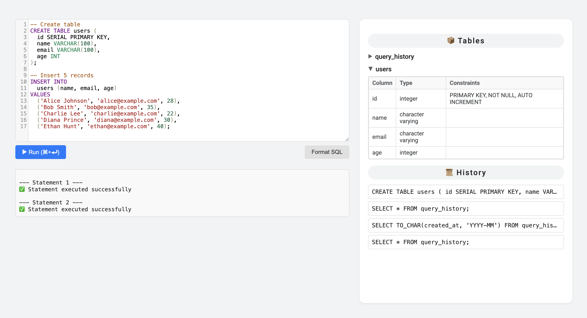

# 🐘 PostgreSQL Playground


A web-based interactive playground to experiment with PostgreSQL queries in real-time. Built using Flask and Docker, this project provides a safe, isolated environment for learning and testing SQL queries with PostgreSQL.

---

## 🚀 Features

- ✅ Run PostgreSQL queries in a sandboxed environment
- 🐳 Dockerized for easy local setup
- ⚡ Fast response with a clean and interactive UI
- 📦 Minimal dependencies, quick to get started

---

## 🖥️ Demo

[](https://www.youtube.com/watch?v=HSmBthnsH0I)

Click the preview above to watch the demo on YouTube.

---

## 🛠️ Tech Stack

- **Backend**: Python, Flask
- **Database**: PostgreSQL
- **Frontend**: HTML, CSS, JavaScript
- **Containerization**: Docker, Docker Compose

---

## 📦 Project Structure

```
.
├── app.py
├── CONTRIBUTING.md
├── docker-compose.yml
├── Dockerfile
├── LICENSE
├── Readme.md
├── requirements.txt
├── static
│   ├── css
│   │   └── styles.css
│   ├── images
│   │   ├── favicon.png
│   │   └── screenshot.png
│   └── js
│       ├── editorManager.js
│       ├── script.js
│       └── tableManager.js
└── templates
    └── index.html
```

---

## ⚙️ Getting Started

### Prerequisites

- [Docker](https://www.docker.com/)
- [Docker Compose](https://docs.docker.com/compose/)

### Run Locally

Clone the repository and start the containers:

```bash
git clone https://github.com/YOUR_GITHUB_USERNAME/postgresql-playground.git
cd postgresql-playground
docker-compose up --build
```

Then open your browser and go to:  
[http://localhost:5000](http://localhost:5000)

---

## 🧪 Usage

- Type your SQL queries into the provided interface.
- Click **Run** to execute the query.
- See results immediately from the PostgreSQL database.

> ⚠️ This is for educational/demo purposes. Not recommended for production environments without modification.

---

## 🤝 Contributing

Contributions are welcome!  
Here’s how you can help:

- ⭐ Star this repo to show support
- 🐞 Report bugs or request features via [Issues](https://github.com/YOUR_GITHUB_USERNAME/postgresql-playground/issues)
- 📥 Fork the repo and submit a pull request

Please read the [CONTRIBUTING.md](CONTRIBUTING.md) for guidelines.

---

## 📄 License

This project is licensed under the [MIT License](LICENSE).

---

## 🙌 Acknowledgments

- Inspired by online SQL playgrounds and educational tools.
- Thanks to the open-source community for libraries and tools!

---

## 📬 Contact

Created by **[Your Name]** – [@yourtwitter](https://twitter.com/yourtwitter)  
Follow me on [GitHub](https://github.com/YOUR_GITHUB_USERNAME)
